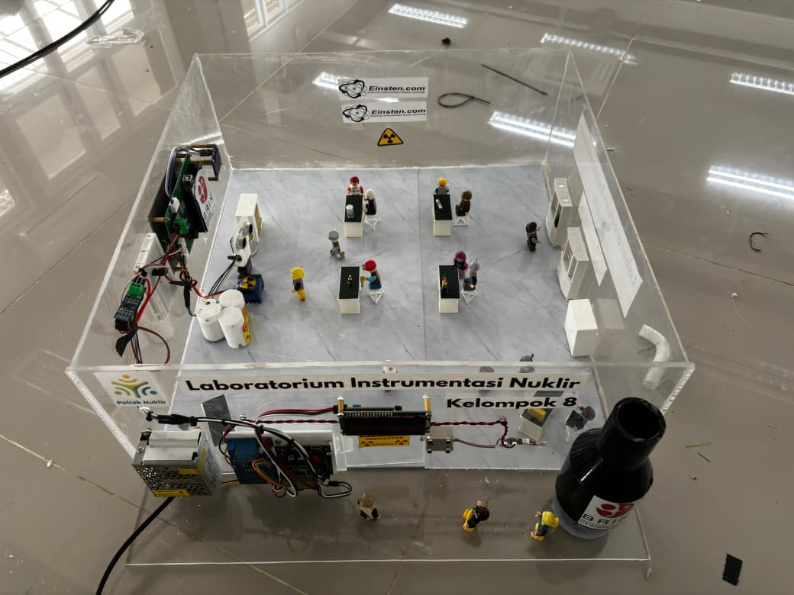
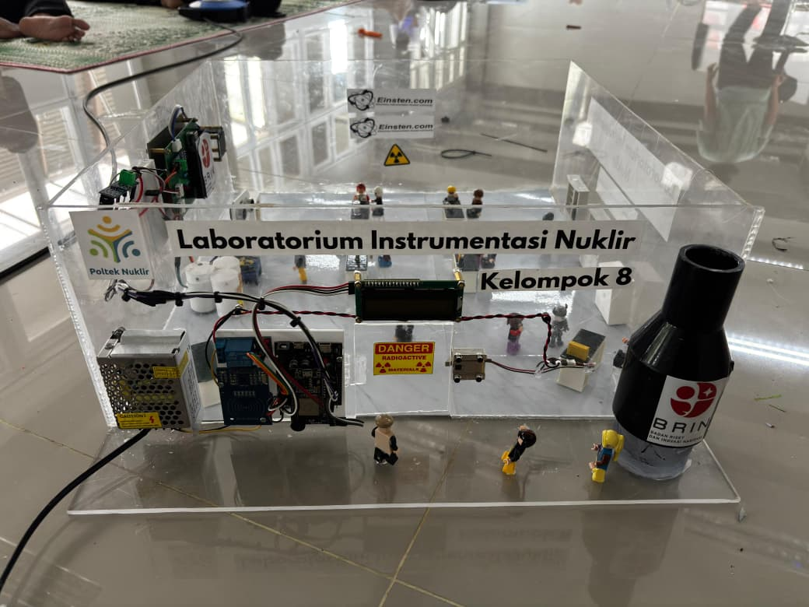

# Smart Radiation Monitoring System Berbasis IoT

[](https://opensource.org/licenses/MIT)

**Kelompok 8 - PKM**  
Implementasi Smart Radiation Monitoring System Berbasis IoT untuk Optimalisasi Keselamatan Radiasi di Laboratorium Instrumentasi Nuklir

## 📋 Deskripsi Teknis

Sistem monitoring radiasi berbasis IoT yang mengintegrasikan autentikasi RFID dan radar ultrasonik untuk keamanan dan deteksi pergerakan di area laboratorium nuklir. Sistem ini menggunakan arsitektur dual-microcontroller dengan komunikasi RS485 dan protokol MQTT untuk remote monitoring.

## 📸 Hasil Project

<div align="center">

### Sistem RFID Access Control & Monitoring


### Radar System dengan OLED Display


</div>

## 🏗️ Arsitektur Sistem

### Komponen Hardware

#### ESP32 (Master Controller)
- **RFID Access Control**: MFRC522 module (SPI)
- **RS485 Communication**: Half-duplex serial communication
- **IoT Connectivity**: WiFi + MQTT protocol
- **Display**: LCD I2C 16x2
- **Actuators**: 
  - Relay module (door lock)
  - Buzzer (PWM 2kHz)
  - Dual LED indicators (Red/Green)

#### Arduino (Radar System)
- **Ultrasonic Sensor**: HC-SR04 (max range: 30cm)
- **Servo Motor**: 180° scanning mechanism
- **OLED Display**: SH1106 128x64 (I2C)
- **RS485 Module**: Slave device
- **Alert System**: LED indicators + buzzer

### Komunikasi Antar Sistem

```
ESP32 ←→ [RS485] ←→ Arduino
  ↓
[WiFi/MQTT]
  ↓
MQTT Broker (broker.emqx.io)
```

## 🔧 Spesifikasi Teknis

### Pin Configuration

**ESP32:**
```
RFID:     SS=5, RST=15
RS485:    TX=26, RX=25, RE/DE=27
Hardware: RELAY=4, BUZZER=14, LED_R=32, LED_G=33
I2C:      SDA=21, SCL=22 (LCD)
```

**Arduino:**
```
RS485:       RO=2, DI=3, DE/RE=4
Ultrasonic:  TRIG=8, ECHO=9
Servo:       PWM=6
Alert:       LED_G=13, LED_R=12, BUZZER=11
I2C:         SDA=A4, SCL=A5 (OLED)
```

### Parameter Operasional

- **Danger Threshold**: ≤15 cm
- **Detection Range**: 30 cm
- **Servo Step**: 2° per scan cycle
- **Scan Angle**: 0° - 180°
- **Baud Rate**: 9600 (Serial & RS485)
- **MQTT Port**: 1883

## 📡 MQTT Topics

| Topic | Payload | Deskripsi |
|-------|---------|-----------|
| `JogloAtas/data/door` | 0/1 | Door lock status |
| `JogloAtas/data/alarm` | 0/1 | Alarm activation status |

## 🚀 Cara Kerja

### 1. Access Control Flow
1. User menempelkan RFID card
2. ESP32 verifikasi UID (Target: `243 39 158 52`)
3. **Valid**: 
   - Relay aktif (door unlock 5s)
   - Kirim `'1'` via RS485 → Radar ON
   - Publish MQTT status
4. **Invalid**:
   - Alarm triggered
   - Kirim `'0'` via RS485 → Radar OFF
   - Publish alert

### 2. Radar Monitoring
- Servo sweep 0°-180° dengan step 2°
- Ultrasonic measurement setiap cycle
- Real-time visualization pada OLED
- Threshold detection:
  - **≤15cm**: Alert mode (LED merah + buzzer)
  - **>15cm**: Safe mode (LED hijau)

### 3. Display Information
- **LCD**: Lab name & access status
- **OLED**: Radar visualization (angle, distance, threat level)

## 📦 Dependencies

### ESP32
```cpp
#include <SPI.h>
#include <RFID.h>
#include <WiFi.h>
#include <PubSubClient.h>
#include <LiquidCrystal_I2C.h>
```

### Arduino
```cpp
#include <Adafruit_GFX.h>
#include <Adafruit_SH110X.h>
#include <Servo.h>
#include <SoftwareSerial.h>
```

## ⚙️ Instalasi

1. **Clone repository:**
   ```bash
   git clone <repository-url>
   cd kel8
   ```

2. **Install libraries** via Arduino IDE Library Manager

3. **Konfigurasi WiFi** di `rfid/rfid.ino`:
   ```cpp
   char* ssid = "YOUR_SSID";
   char* pass = "YOUR_PASSWORD";
   ```

4. **Upload firmware:**
   - ESP32: `rfid/rfid.ino`
   - Arduino: `radar/radar.ino`

5. **Wiring** sesuai pin configuration

## 🔐 Security Features

- RFID-based authentication
- Unique UID validation
- RS485 half-duplex secured communication
- MQTT encrypted transmission (upgrade to TLS recommended)
- Physical access control via relay

## 📊 Monitoring Dashboard

Data dapat dimonitor melalui MQTT client:
```bash
mosquitto_sub -h broker.emqx.io -t "JogloAtas/data/#" -v
```

## 🛠️ Troubleshooting

| Issue | Solution |
|-------|----------|
| Radar tidak respon | Check RS485 wiring (DE/RE pin) |
| RFID tidak terbaca | Verifikasi SPI connection & power supply |
| MQTT disconnect | Check WiFi stability & broker status |
| Servo jitter | Tambahkan capacitor 100µF pada VCC servo |


## 👥 Tim Pengembang

**Kelompok 8 - PKM 2025**  
Program Kreativitas Mahasiswa

## 📄 Lisensi

MIT License

Copyright (c) 2024 Kelompok 8

Permission is hereby granted, free of charge, to any person obtaining a copy
of this software and associated documentation files (the "Software"), to deal
in the Software without restriction, including without limitation the rights
to use, copy, modify, merge, publish, distribute, sublicense, and/or sell
copies of the Software, and to permit persons to whom the Software is
furnished to do so, subject to the following conditions:

The above copyright notice and this permission notice shall be included in all
copies or substantial portions of the Software.

THE SOFTWARE IS PROVIDED "AS IS", WITHOUT WARRANTY OF ANY KIND, EXPRESS OR
IMPLIED, INCLUDING BUT NOT LIMITED TO THE WARRANTIES OF MERCHANTABILITY,
FITNESS FOR A PARTICULAR PURPOSE AND NONINFRINGEMENT. IN NO EVENT SHALL THE
AUTHORS OR COPYRIGHT HOLDERS BE LIABLE FOR ANY CLAIM, DAMAGES OR OTHER
LIABILITY, WHETHER IN AN ACTION OF CONTRACT, TORT OR OTHERWISE, ARISING FROM,
OUT OF OR IN CONNECTION WITH THE SOFTWARE OR THE USE OR OTHER DEALINGS IN THE
SOFTWARE.

---
